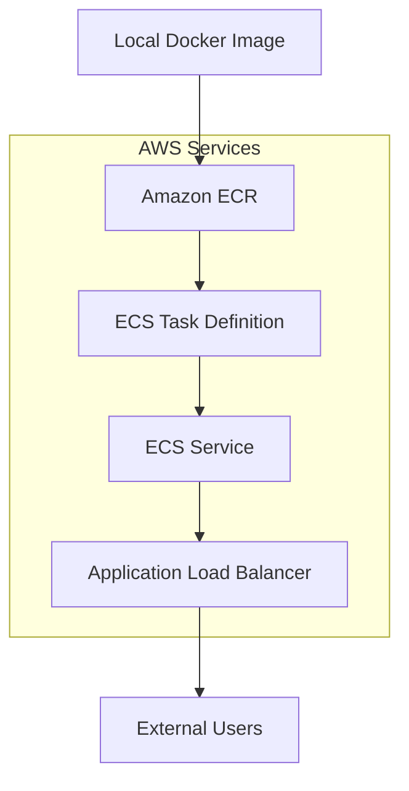

# AWS Deployment Guide for ML Docker Demo

This guide shows how to deploy your containerized ML model from the main project to AWS cloud services. This extends the local Docker deployment covered in `README.MD` to production-ready cloud deployment.

## 🏗️ Architecture Overview



---

## 🚀 Deployment Options Comparison

### **Option 1: Local Testing vs Option 2: AWS Deployment**

| Aspect | Local Deployment | AWS Deployment |
|--------|------------------|----------------|
| **Container Management** | `docker run` manually | AWS ECS manages containers |
| **Access URL** | `localhost:5000` | Load Balancer DNS or App Runner URL |
| **Scaling** | Manual restart | AWS auto-scaling |
| **Stopping** | `Ctrl+C` or `docker stop` | AWS service management |
| **Cost** | Free (your machine) | Pay-per-use AWS resources |

---

## 📋 Prerequisites

### **AWS CLI Setup**
```bash
# Install AWS CLI
pip install awscli

# Configure credentials
aws configure
# Enter: Access Key ID, Secret Access Key, Region (e.g., us-east-1), Output format (json)

# Verify setup
aws sts get-caller-identity
```

### **Docker Image Ready**
Ensure you have your image built locally:
```bash
# From your main project
docker build -t ml-model-api .
docker images | grep ml-model-api  # Verify image exists
```

---

## 🐳 Method 1: Amazon ECS (Elastic Container Service)

### **Step 1: Create ECR Repository**
```bash
# Create repository
aws ecr create-repository --repository-name ml-model-api --region us-east-1

# Get login token and login to ECR
aws ecr get-login-password --region us-east-1 | docker login --username AWS --password-stdin YOUR_ACCOUNT_ID.dkr.ecr.us-east-1.amazonaws.com
```

### **Step 2: Tag and Push Image**
```bash
# Tag your image for ECR
docker tag ml-model-api:latest YOUR_ACCOUNT_ID.dkr.ecr.us-east-1.amazonaws.com/ml-model-api:latest

# Push to ECR
docker push YOUR_ACCOUNT_ID.dkr.ecr.us-east-1.amazonaws.com/ml-model-api:latest

# Verify upload
aws ecr describe-images --repository-name ml-model-api
```

### **Step 3: Create ECS Task Definition**
```bash
# Create task-definition.json
cat > task-definition.json << 'EOF'
{
  "family": "ml-model-api",
  "networkMode": "awsvpc",
  "requiresCompatibilities": ["FARGATE"],
  "cpu": "256",
  "memory": "512",
  "executionRoleArn": "arn:aws:iam::YOUR_ACCOUNT_ID:role/ecsTaskExecutionRole",
  "containerDefinitions": [
    {
      "name": "ml-model-api",
      "image": "YOUR_ACCOUNT_ID.dkr.ecr.us-east-1.amazonaws.com/ml-model-api:latest",
      "portMappings": [
        {
          "containerPort": 5000,
          "protocol": "tcp"
        }
      ],
      "essential": true,
      "logConfiguration": {
        "logDriver": "awslogs",
        "options": {
          "awslogs-group": "/ecs/ml-model-api",
          "awslogs-region": "us-east-1",
          "awslogs-stream-prefix": "ecs"
        }
      }
    }
  ]
}
EOF

# Register task definition
aws ecs register-task-definition --cli-input-json file://task-definition.json
```

### **Step 4: Create ECS Service**
```bash
# Create ECS cluster
aws ecs create-cluster --cluster-name ml-model-cluster

# Create service
aws ecs create-service \
    --cluster ml-model-cluster \
    --service-name ml-model-service \
    --task-definition ml-model-api:1 \
    --desired-count 1 \
    --launch-type FARGATE \
    --network-configuration "awsvpcConfiguration={subnets=[subnet-12345],securityGroups=[sg-12345],assignPublicIp=ENABLED}"
```

### **Step 5: Set Up Application Load Balancer**
```bash
# Create load balancer
aws elbv2 create-load-balancer \
    --name ml-model-alb \
    --subnets subnet-12345 subnet-67890 \
    --security-groups sg-12345

# Create target group
aws elbv2 create-target-group \
    --name ml-model-targets \
    --protocol HTTP \
    --port 5000 \
    --vpc-id vpc-12345 \
    --target-type ip \
    --health-check-path /predict

# Create listener
aws elbv2 create-listener \
    --load-balancer-arn YOUR_ALB_ARN \
    --protocol HTTP \
    --port 80 \
    --default-actions Type=forward,TargetGroupArn=YOUR_TARGET_GROUP_ARN
```

---

## 🚀 Method 2: AWS App Runner (Simplest)

### **Step 1: Create App Runner Service**
```bash
# Create apprunner.yaml configuration
cat > apprunner.yaml << 'EOF'
version: 1.0
runtime: docker
build:
  commands:
    build:
      - echo "No build commands"
run:
  runtime-version: latest
  command: python app.py
  network:
    port: 5000
    env: PORT
  env:
    - name: PORT
      value: "5000"
EOF

# Create service using AWS console or CLI
aws apprunner create-service \
    --service-name ml-model-app \
    --source-configuration '{
        "ImageRepository": {
            "ImageIdentifier": "YOUR_ACCOUNT_ID.dkr.ecr.us-east-1.amazonaws.com/ml-model-api:latest",
            "ImageConfiguration": {
                "Port": "5000"
            },
            "ImageRepositoryType": "ECR"
        },
        "AutoDeploymentsEnabled": false
    }' \
    --instance-configuration '{
        "Cpu": "0.25 vCPU",
        "Memory": "0.5 GB"
    }'
```

---

## 🧪 Testing Your AWS Deployment

### **Get Your Endpoint URL**

#### **For ECS with Load Balancer:**
```bash
# Get load balancer DNS name
aws elbv2 describe-load-balancers \
    --names ml-model-alb \
    --query 'LoadBalancers[0].DNSName' \
    --output text
```

#### **For App Runner:**
```bash
# Get service URL
aws apprunner describe-service \
    --service-arn YOUR_SERVICE_ARN \
    --query 'Service.ServiceUrl' \
    --output text
```

### **Test the Deployed API**
```bash
# Replace YOUR_AWS_URL with actual endpoint
curl -X POST http://YOUR_AWS_URL/predict \
     -H "Content-Type: application/json" \
     -d '{"features": [5.1, 3.5, 1.4, 0.2]}'

# Expected response
{"prediction": 0}
```

### **Test from Different Locations**
```bash
# Test from your local machine
curl -X POST http://YOUR_AWS_URL/predict \
     -H "Content-Type: application/json" \
     -d '{"features": [5.1, 3.5, 1.4, 0.2]}'

# Test with verbose output to see headers
curl -v -X POST http://YOUR_AWS_URL/predict \
     -H "Content-Type: application/json" \
     -d '{"features": [5.1, 3.5, 1.4, 0.2]}'
```

---

## 🔧 Key Differences: Local vs AWS

### **Container Management**

**Local Development:**
```bash
# You control everything manually
docker run -p 5000:5000 ml-model-api  # Start
curl http://localhost:5000/predict     # Test
docker stop CONTAINER_ID               # Stop
```

**AWS Deployment:**
```bash
# AWS manages the containers
aws ecs update-service --service ml-model-service --desired-count 2  # Scale up
aws ecs update-service --service ml-model-service --desired-count 0  # Scale down
# No direct 'docker run' commands needed
```

### **Access Patterns**

| Environment | Access Method | URL Pattern | Port Mapping |
|-------------|---------------|-------------|--------------|
| **Local Flask** | `python app.py` | `http://localhost:5000` | Direct process |
| **Local Docker** | `docker run -p 5000:5000` | `http://localhost:5000` | Host → Container |
| **AWS ECS** | Load Balancer | `http://alb-dns-name` | Internet → ALB → Container |
| **AWS App Runner** | Managed Service | `https://app-url.region.awsapprunner.com` | Automatic HTTPS |

---

## 🔍 Monitoring and Debugging

### **View Container Logs**
```bash
# ECS Fargate logs
aws logs describe-log-streams \
    --log-group-name /ecs/ml-model-api

aws logs get-log-events \
    --log-group-name /ecs/ml-model-api \
    --log-stream-name ecs/ml-model-api/TASK_ID
```

### **Check Service Health**
```bash
# ECS service status
aws ecs describe-services \
    --cluster ml-model-cluster \
    --services ml-model-service

# App Runner service status
aws apprunner describe-service \
    --service-arn YOUR_SERVICE_ARN
```

### **Debug Common Issues**

| Issue | Local Debugging | AWS Debugging |
|-------|----------------|---------------|
| **Container won't start** | `docker logs CONTAINER_ID` | Check ECS service events |
| **Port not accessible** | Check `docker ps` ports | Check security groups |
| **App crashes** | Check terminal output | Check CloudWatch logs |
| **Health check fails** | Test `curl localhost:5000` | Check target group health |

---

## 💰 Cost Optimization

### **Development vs Production**

**Development:**
```bash
# Use smallest instances
aws apprunner create-service --instance-configuration '{
    "Cpu": "0.25 vCPU",
    "Memory": "0.5 GB"
}'

# Scale to zero when not in use
aws ecs update-service --desired-count 0
```

**Production:**
```bash
# Use appropriate sizing
aws apprunner create-service --instance-configuration '{
    "Cpu": "1 vCPU", 
    "Memory": "2 GB"
}'

# Enable auto-scaling
aws ecs put-scaling-policy --service-name ml-model-service
```

---

## 🔒 Security Best Practices

### **Network Security**
```bash
# Security group for ECS (only allow HTTP)
aws ec2 create-security-group \
    --group-name ml-model-sg \
    --description "ML Model API Security Group"

aws ec2 authorize-security-group-ingress \
    --group-id sg-12345 \
    --protocol tcp \
    --port 5000 \
    --cidr 0.0.0.0/0
```

### **IAM Roles**
```json
{
  "Version": "2012-10-17",
  "Statement": [
    {
      "Effect": "Allow",
      "Action": [
        "ecr:GetAuthorizationToken",
        "ecr:BatchCheckLayerAvailability",
        "ecr:GetDownloadUrlForLayer",
        "ecr:BatchGetImage"
      ],
      "Resource": "*"
    }
  ]
}
```

---

## 🚀 CI/CD Integration

### **Automated Deployment Pipeline**
```bash
# Build and deploy script
#!/bin/bash
set -e

# Build image
docker build -t ml-model-api .

# Tag for ECR
docker tag ml-model-api:latest $ECR_REPO:$BUILD_NUMBER

# Push to ECR
docker push $ECR_REPO:$BUILD_NUMBER

# Update ECS service
aws ecs update-service \
    --cluster ml-model-cluster \
    --service ml-model-service \
    --force-new-deployment
```

---

## 📊 Comparison Summary

### **When to Use Each Method**

| Use Case | Recommended Service | Why |
|----------|-------------------|-----|
| **Learning/Demo** | App Runner | Simplest setup, automatic HTTPS |
| **Production API** | ECS + ALB | Full control, load balancing |
| **High Traffic** | ECS + Auto Scaling | Handles variable load |
| **Cost-Sensitive** | ECS Spot Instances | Reduced costs |

### **Command Comparison**

| Action | Local | AWS ECS | AWS App Runner |
|--------|-------|---------|---------------|
| **Deploy** | `docker run` | `aws ecs create-service` | `aws apprunner create-service` |
| **Scale** | Start more containers | `aws ecs update-service` | Automatic |
| **Stop** | `docker stop` | `--desired-count 0` | `aws apprunner pause-service` |
| **Logs** | `docker logs` | `aws logs get-log-events` | Built-in dashboard |

---

## 🎯 Next Steps

1. **Start with App Runner** for simplicity
2. **Monitor costs** in AWS billing dashboard  
3. **Set up alerts** for service health
4. **Consider API Gateway** for advanced features
5. **Implement CI/CD** for automated deployments

---

*This AWS deployment guide extends the comprehensive Docker development workflow from the main README.MD to production cloud deployment.*
